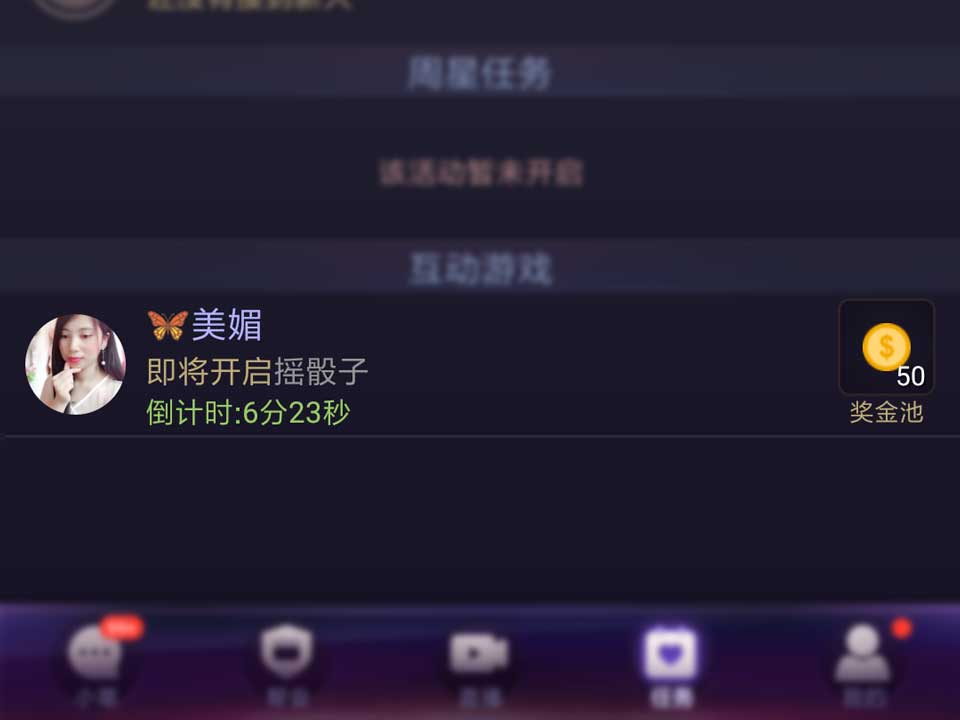

- handler机制实现的礼物连送，实现如下

  ```java
  private void pumpGift() {
      //make sure run main thread
      if (mPumping) {
          return;
      } else {
          mPumping = true;
      }
      if (mList.size() == 0 || mTrackView == null) {
          mPumping = false;
          return;
      }
      //...
      invoke(new Runnable() {
          @Override
          public void run() {
              pumpGift();
          }
      }, 500);
      mPumping = false;
  }

  private void invoke(Runnable runnable, long delay) {
      if (null == mHandler) {
          mHandler = new Handler(Looper.getMainLooper());
      }
      mHandler.postDelayed(runnable, delay);
  }
  ```

  从而执行每500毫秒检测一次轨道的任务，在视图要结束的时候，通过`removeMessage`来结束循环调用。

  ```java
  public void cancelScheduleThread() {
      if (null != mHandler) {
          mHandler.removeCallbacksAndMessages(null);
          mHandler = null;
      }
      //...
  }
  ```

- 项目中有一个预热列表需要加入倒计时，且计时器跑完移除对应的项目。如下图：

  

  网上看到一篇写recyclerView计时器的，它的每个item都需要计时，所以都开了`CountDownTimer`，并且在ViewHolder的`onViewDetachedFromWindow`未做任何处理。随着列表的滑动，卡顿不言而喻。我采用了订阅者模式解决这个问题，核心代码如下：

  ```java
  public final class TimeEventEmitter extends Observable {
      //。。。

      public final void startTimerTask() {
          //...
          try {
              //...
              TaskEngine.getInstance().schedule(mTimerTask, mInterval > 0 ? mInterval : INTERVAL,
                      mInterval > 0 ? mInterval : INTERVAL);
          } catch (IllegalStateException ex) {
              //...
              startTimerTask();
          }
      }
      //。。。

      private class EmitterSchedule extends TimerTask {

          @Override
          public void run() {
              //work thread
              setChanged();
              notifyObservers();
          }
      }
  }
  ```

  在需要订阅的视图处，订阅时间事件：

  ```java
  @Override
  protected void onViewAttachedToWindow(@NonNull InteractTaskHolder holder) {
      TaskDataManager.receive(holder);
  }

  @Override
  protected void onViewDetachedFromWindow(@NonNull InteractTaskHolder holder) {
      TaskDataManager.reject(holder);
  }

  public static class InteractTaskHolder extends RecyclerView.ViewHolder implements Observer {
      //private members...

      public void bindHolderWithData(final InteractListBean interactListBean, @Nullable final int flag) {
          //...
          long remain = interactListBean.time - current;
          //...
          if (interactListBean.sid == 0) {
              //可领取奖励...
          } else {
              //...
              if (remain < 0) {
                  //已经结束预热
                  TaskDataManager.reject(this);
                  //...
                  return;
              }
          }
      }

      @Override
      public void update(Observable o, Object arg) {
          //...worker thread
          final long remain = mData.time - current;
          if (remain < 0) {
              TaskDataManager.reject(this);
              //...
              return;
          }
          handler.post(new Runnable() {
              @Override
              public void run() {
                  //...
              }
          });
      }
  }
  ```

  同时在`onViewDetachedFromWindow`中解除订阅。

- 复杂界面直接绘制要比嵌套布局的方式快很多，不会发生页面加载延迟。

  

  核心代码实现：

  ```java
  public class HistogramSunView extends View {
      //members

      @Override
      protected void onMeasure(int widthMeasureSpec, int heightMeasureSpec) {
          //固定高度***
          int height = (int) TypedValue.applyDimension(TypedValue.COMPLEX_UNIT_DIP, ***, getResources().getDisplayMetrics());
          heightMeasureSpec = MeasureSpec.makeMeasureSpec(height, MeasureSpec.EXACTLY);
          super.onMeasure(widthMeasureSpec, heightMeasureSpec);
      }

      public void gearIt(SunshineRootBean info) {
          //...
          invalidate();
      }
      //...
      @Override
      public void draw(Canvas canvas) {
          super.draw(canvas);
          //...
          //draw rect and val text
          int save3 = canvas.save();
          canvas.translate(transX, HEIGHT_PIXEL_ABOVE_HISTOGRAM - mBgHeight);
          for (int i = 0; i <= mConfig.mCurrentRect; i++) {
              HistogramRect rect = mRectSparseArray.get(i);
              if (null == rect) {
                  continue;
              }
              //...
              if (i == mConfig.mCurrentRect) {
                  //...
                  if (mConfig.mRectProgress > 0) {
                      rect.draw(canvas, mConfig.mRectProgress);
                  }
              } else {
                  rect.draw(canvas, 1);
              }
          }
          canvas.restoreToCount(save3);
          //...
      }
      
      //...初始化绘制数据代码

      public class HistogramRect {
          //...

          public void draw(Canvas canvas, float percent) {
              int save = canvas.save();
              canvas.translate(mPaddingLeftPixel, mBgHeight - mHeightPixel);
              mRectDrawable.setBounds(new Rect(0, 0, WIDTH_PIXEL_RECT,
                      (int) (mHeightPixel - TypedValue.applyDimension(TypedValue.COMPLEX_UNIT_DIP, 1,
                              getResources().getDisplayMetrics()))));
              mRectDrawable.setLevel((int) (percent * 10000));
              mRectDrawable.draw(canvas);
              //...
              canvas.restoreToCount(save);
          }
      }
      //...
  }
  ```

- 模板方法模式，将通用的方法抽到父类，例如市场模块，买和卖非常相似。

  

  核心代码实现：

  ```java
  public abstract class BaseEasyTradeDialogFragment<T extends BasePresenter> extends BaseEnhancedDialogFragment<T> {
     //...

      @Override
      protected void initGlobalViews() {
          //...
          mEtNum.addTextChangedListener(mTextWatcher = new SimpleTextWatcher() {
              @Override
              public void afterTextChanged(Editable s) {
                  //...
                  onTextItemNum(s);
              }
          });
          //...
          extraViewInit();
          //...
      }

      @Override
      public void onDestroyView() {
          if (null != mTextWatcher) {
              mEtNum.removeTextChangedListener(mTextWatcher);
              mTextWatcher = null;
          }
          //...
          super.onDestroyView();
      }

      /**
       * @return 库存数量
       */
      protected abstract int getGoodTotalNum();

      protected abstract void onTextItemNum(CharSequence sequence);

      protected void extraViewInit() {

      }

      /**
       * 点击交易按钮更多的判断逻辑 返回true交易中断
       *
       * @return
       */
      protected abstract boolean moreTradeButtonJudgement();
      //...
      @OnClick(R.id.tvBuy)
      public void onBuyClicked(View v) {
          if (//...
              || moreTradeButtonJudgement()) {
              //...
              return;
          }
          trading = true;
          carryYourTradeLogical();
      }

      /**
       * 交易请求逻辑
       */
      protected abstract void carryYourTradeLogical();
  	//...
  }
  ```

  子类只需要实现父类暴露的方法，再添加上自己额外的逻辑即可。

  ```java
  public class EasyBuyDialogFragment extends BaseEasyTradeDialogFragment<EasyBuyContract.Presenter> implements EasyBuyContract.View {
      //...

      @Override
      protected int getGoodTotalNum() {
          //...
      }

      @Override
      protected void extraViewInit() {
          //...
      }

      @Override
      protected void onTextItemNum(CharSequence sequence) {
          //...
          Matcher matcher = NUMBER_PATTERN.matcher(sequence);
          if (matcher.matches()) {
              //...
              if (abnormal) {
                  //...
                  return;
              }
          } else {
              //...
              return;
          }
          updateTradeUIExpression();
      }

      @Override
      protected boolean moreTradeButtonJudgement() {
          if (mYouCantAffordIt) {
              //...
              return true;
          }
          return false;
      }
      //...

      private void updateTradeUIExpression() {
          if (null == mTradeItem) {
              return;
          }
          //...子类自己的显示逻辑
      }

      @Override
      public void purchaseResult(boolean success, long goodId, int pickedQuantites) {
          if (success) {
              //...
              dismissAllowingStateLoss();
          }
          trading = false;
      }

      @Override
      protected void carryYourTradeLogical() {
          //...
          mPresenter.***(mTradeItem.goodId, mPickedQuantites);
      }

  }
  ```

  同样的实现在任务模块和红包模块也都用到，就不一一罗列。

  我写代码的思路，和规范性大致向上面那样，当然如果将入职公司有自己的规范，我会首先着重熟悉并严格执行，也会悉心接受提交代码的review。
